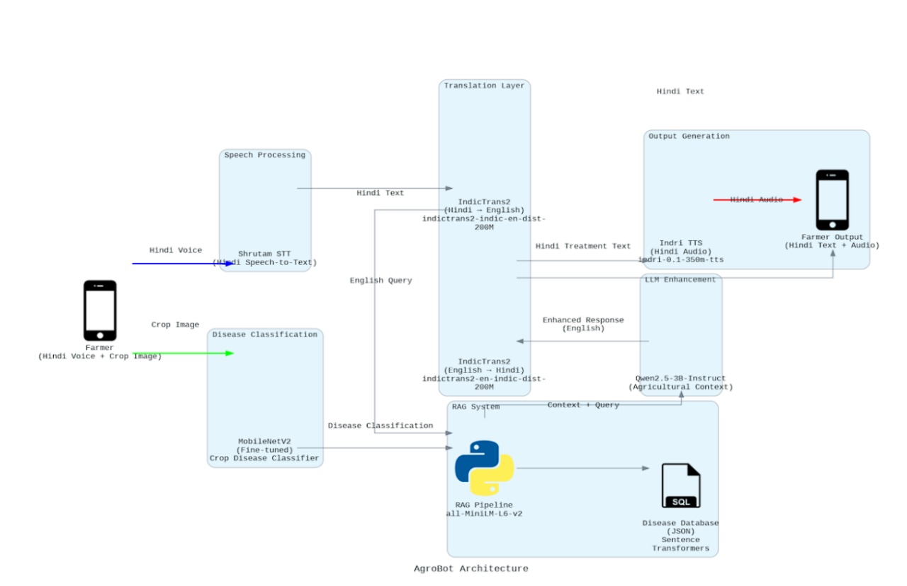

# AgroBot - Our AI-Powered Crop Disease Assistant

AgroBot is basically an intelligent agricultural assistant that helps farmers identify crop diseases through voice interactions and image analysis. The system combines speech recognition, computer vision, and NLP to provide treatment recommendations in local languages (hindi).

# Project Testing
Our project can be tested by running a kaggle notebook which has all the implementations. The link is here:
[Notebook implementation](https://www.kaggle.com/code/zoomershredder/chatbot-agrobot)


## Architecture


## 🚀 Features

- **Voice-to-Voice Interaction**: Speak in Hindi and get audio responses back in Hindi. This is done keeping in mind the end users will be farmers.
- **Crop Disease Classification**: AI-powered image analysis using fine-tuned MobileNetV2 - a vision model capable of running on edge devices.
- **Multilingual Support**: Hindi speech input/output with English processing
- **Treatment Recommendations**: RAG-based system which geenrates enriched context so that the LLM(Qwen-2.5-Instruct) doesn't hallucinate.
- **Web Interface**: Easy-to-use browser-based interface

## 🏗️ System Architecture

```
Audio Input (Hindi) → STT → Translation (Hi→En) → Disease Classification (Image) → RAG System → LLM → Translation (En→Hi) → TTS → Audio Output (Hindi)
```

### Processing Pipeline

1. **Speech-to-Text (STT)**: Shrutam model converts Hindi speech to text using Shrutam model
2. **Language Translation**: Translates Hindi text to English using IndicTrans2
3. **Image Classification**: Analyzes crop images using fine-tuned MobileNetV2
4. **RAG Processing**: Retrieves relevant information from disease database using `sentence-transformers/all-MiniLM-L6-v2` for embedding generation and cosine similarity for relevant context generation.
5. **LLM**: Generates relevant response using generated context from RAG as well as user query using Qwen-2.5-Instruct(3M).
6. **Response Translation**: Converts English response back to Hindi using IndicTrans2
7. **Text-to-Speech (TTS)**: Generates Hindi audio response using Piper-TTS.

## 📋 Prerequisites

- Python 3.11.13
- Required model files (see Model Setup section)
Note we currently have tested this for Python==3.11.13 as for higher versions it gives some dependancy errors.
## 🛠️ Installation

1. **Clone the repository**
```bash
git clone <repository-url>
cd agrobot
```

These commands are specific to Linux Terminal
Check python version using
```bash
python --version
```
If the version is not 3.11.13, then follow these steps to download it:
```bash
sudo apt update
sudo apt install python3.11 python3.11-venv python3.11-dev -y
```
Create virtual environment:
```bash
python3.11 -m venv .agorbot
```
Start the virtual enviroment
```bash
source .agorbot/bin/activate
```

2. **Install dependencies**
```bash
pip install -r requirements.txt
```


## 📦 Model Setup

### Required Models

1. **Shrutam STT Model**
   - Config: `shrutam_model/Branchformer1024/config.yaml`
   - Weights: `shrutam_model/Branchformer1024/model.pth`

You can get these files by downloading the model folder from [this link](https://huggingface.co/bharatgenai/Shrutam-HindiASR-1.0/tree/main). From here download the complete folder.

2. **MobileNetV2 Crop Disease Classifier**
   - Path: `models\best_finetuned_model.pth`


For translation right now we directly download the model in cache from HuggingFace.


3. **TTS Model**
   - speaker file: `hi_speakers/hi_IN-pratham-medium.onnx`

## 📊 Database Structure

The system uses a JSON database (`database/disease_database.json`) containing:

```json
{
  "crop": "Corn",
  "disease": "Northern Leaf Blight",
  "symptoms": "Cigar-shaped gray-green lesions on leaves...",
  "treatment": "Use resistant hybrids. Apply fungicides..."
}
```
We use sentence transformer(sentence-transformers/all-MiniLM-L6-v2) to convert it to embedding and then use cosine similarity for relevant context generation.

### Supported Crops & Diseases

- **Corn**: Common Rust, Gray Leaf Spot, Northern Leaf Blight, Healthy
- **Potato**: Early Blight, Late Blight, Healthy
- **Rice**: Brown Spot, Leaf Blast, Neck Blast, Healthy
- **Wheat**: Brown Rust, Yellow Rust, Healthy
- **Sugarcane**: Red Rot, Bacterial Blight, Healthy

## 🚀 Usage

### Starting the Application

```bash
python main.py
```

The web interface will be available at `http://localhost:5000`

### Web Interface

1. **Upload Image**: Select a crop image showing disease symptoms
2. **Record Audio**: Click the microphone button and describe the problem in Hindi
3. **Get Response**: Receive treatment recommendations in Hindi (both text and audio)

### API Endpoints

#### Main Processing Pipeline
```http
POST /process
Content-Type: multipart/form-data

Parameters:
- audio: Audio file (WAV/MP3)
- image: Image file (JPG/PNG)

Response:
{
  "rag_response_hi": "Hindi treatment recommendation",
  "audio_url": "/uploads/tts_output.wav"
}
```

## 🔧 Configuration

### Model Paths
Update paths in `main.py`:
```python
MODEL_PATH = "path/to/your/best_finetuned_model.pth"
```


## 📁 Project Structure

```
agrobot/
├── main.py                 # Flask application and main pipeline
├── classifier.py           # MobileNetV2 disease classification
├── stt.py                  # Speech-to-text using Shrutam
├── translators.py          # IndicTrans2 translation models
├── tts.py                  # Text-to-speech processing
├── rag.py                  # RAG system for disease recommendations
├── database/
│   └── disease_database.json  # Disease information database
├── templates/
│   ├── test.html          # Main web interface
│   └── agrobot.html       # Alternative interface
├── uploads/               # Temporary file storage
├── output/                # Generated audio files
└── requirements.txt       # Python dependencies
```

## 🔬 Technical Components

### STT (Speech-to-Text)
- **Model**: Shrutam (ESPnet-based)
- **Language**: Hindi
- **Format**: WAV, 16kHz sampling rate

### Computer Vision
- **Architecture**: MobileNetV2
- **Input**: 224x224 RGB images
- **Classes**: 17 crop-disease combinations
- **Preprocessing**: Standard ImageNet normalization

### Translation
- **Model**: IndicTrans2
- **Direction**: Hindi ↔ English
- **Max Length**: 256 tokens

### RAG System
- **Embeddings**: sentence-transformers/all-MiniLM-L6-v2
- **Similarity**: Cosine similarity
- **Retrieval**: Top-K matching (default: 3)

### LLM
 - **Model**: Qwen-2.5-Instruct(3M)
### TTS (Text-to-Speech)
- **Model**: Piper python API
- **Language**: Hindi
- **Output**: 16kHz WAV files

## 🎯 Usage Examples

### Example Workflow

1. **User speaks**: "मेरी मक्के की फसल में धब्बे दिख रहे हैं" (My corn crop has spots)
2. **Image uploaded**: Photo of corn leaves with disease symptoms
3. **System processes**:
   - STT: "मेरी मक्के की फसल में धब्बे दिख रहे हैं"
   - Translation: "My corn crop has spots"
   - Image classification: "Corn___Northern_Leaf_Blight"
   - RAG query: combines symptoms with disease prediction
4. **Response**: Treatment recommendations in Hindi audio

## 🐛 Troubleshooting

### Common Issues

1. **Model Loading Errors**
   - Verify model file paths
   - Check CUDA compatibility
   - Ensure sufficient memory

2. **Audio Processing Issues**
   - Verify microphone permissions
   - Check audio format support
   - Ensure proper sampling rate

3. **Translation Errors**
   - Verify IndicTransToolkit installation
   - Check language code mappings
   - Monitor token limits

### Performance Optimization

- Use GPU for faster inference(right now we have kept everything on GPU)
- Adjust batch sizes based on memory
- Optimize image preprocessing
- Cache model embeddings

## 📈 Future Enhancements

- [ ] Support for more crops and diseases
- [ ] Regional language expansion
- [ ] Mobile application
- [ ] Offline mode capability
- [ ] Weather integration
- [ ] Farmer community features

## 🤝 Contributing

1. Fork the repository
2. Create a feature branch
3. Make your changes
4. Add tests if applicable
5. Submit a pull request

## 📄 License

This project is licensed under the MIT License - see the LICENSE file for details.

## 🙏 Acknowledgments

- **Shrutam**: Hindi STT model
- **IndicTrans2**: Multilingual translation
- **MobileNetV2**: Efficient computer vision
- **ESPnet**: Speech processing toolkit
- **Hugging Face**: Model hosting and transformers

## 📞 Support

For questions and support, please open an issue in the GitHub repository.

---

**Note**: Ensure you have the required model files and proper hardware setup before running the application. 